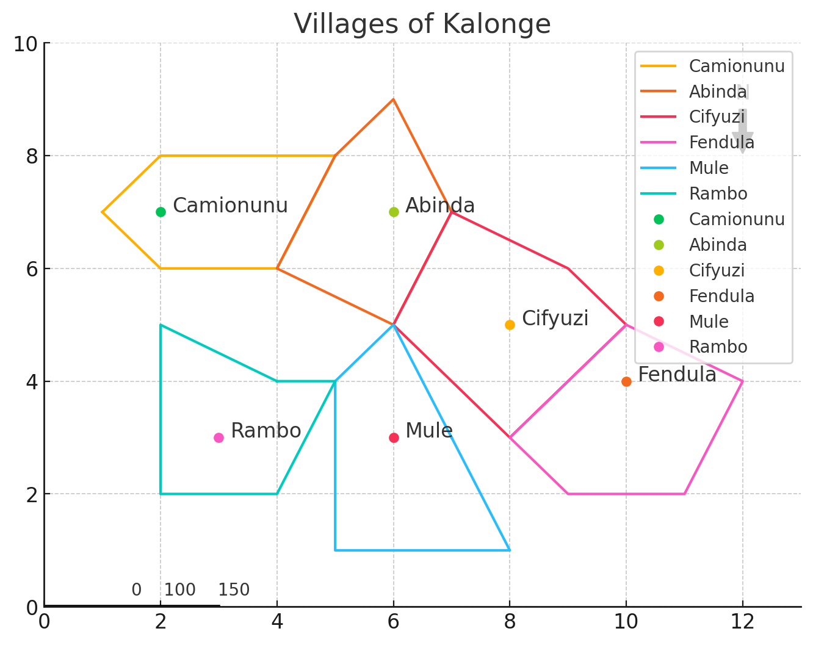

# Kalonge Villages Map

As I am not too active in using QGIS for mapping, I decided to create a map using the Python programming language to demonstrate its capabilities in mapping. This project showcases how to generate a simple geographic map with Python.

## Code Explanation

The code performs the following steps:

1. **Create a Figure and Axis**: Initializes the plotting area using Matplotlib.
2. **Draw Regions**: Defines and plots the borders of different regions on the map.
3. **Mark Village Locations**: Plots and labels the locations of various villages.
4. **Customize the Map**: Adds a title, axis limits, north arrow, and scale bar for clarity.
5. **Save and Display**: Saves the generated map as a PNG file and displays it.

## Code

The Python code used to generate the map can be found in the file [`map_generation.py`](map_generation.py). 

To run the code, make sure you have the necessary Python libraries installed (e.g., Matplotlib). You can then execute the script to generate the map.

## Example Output

